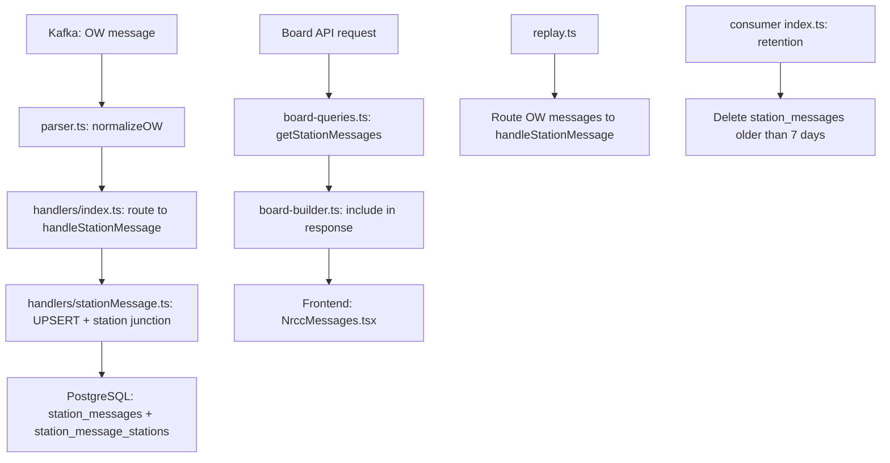
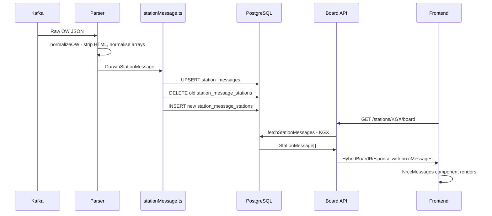

# OW (Station Messages) — Implementation Plan

## Overview

This plan covers Phase 1 from `docs/darwin-outstanding-handlers-plan.md`: implementing the OW (Station Messages) handler end-to-end, from raw Darwin event through to frontend display.

## What We Know About Raw OW Events

The parser (`packages/consumer/src/parser.ts`) already normalises OW messages via `normalizeOW()`:

| Raw Darwin Field | Parser Normalisation | Stored As |
|---|---|---|
| `id` | Passed through | `id: string` |
| `cat` | Aliased to `category` | `cat` + `category` both present |
| `sev` | Aliased to `severity` | `sev` + `severity` both present |
| `suppress` | String boolean → boolean | `suppress: boolean` |
| `Station` | Single object → array | `Station: { crs?: string }[]` |
| `Msg` | HTML stripped → plain text | `message: string` + `messageRaw: string` |

The `DarwinStationMessage` TypeScript type (`packages/shared/src/types/darwin.ts:242-259`) confirms:
- `id` is always present (XSD: `xs:int`)
- `cat`/`sev` are optional
- `Station` is an array of `{ crs?: string }` objects
- `suppress` is boolean after normalisation
- `message` contains the plain-text version; `messageRaw` has the original JSON

**Key insight**: Darwin sends OW messages as **updates** — the same `id` can appear multiple times with changed content. We must UPSERT on `message_id`.

## Architecture Flow



## Step-by-Step Implementation

### Step 1: Investigate Raw OW Events in darwin_events

**Why**: Validate our assumptions about the OW message shape before building the handler. We need to confirm:
- What `cat` values appear in live data
- What `sev` values appear
- Whether `Station` always has `crs`
- Whether `suppress` is commonly `true`
- How often OW messages arrive (volume)
- Whether `id` is truly unique/used for updates

**Action**: Run SQL queries against `darwin_events` to inspect raw OW data:

```sql
-- Count OW events
SELECT count(*) FROM darwin_events WHERE message_type = 'OW';

-- Sample recent OW messages
SELECT raw_json FROM darwin_events WHERE message_type = 'OW' ORDER BY received_at DESC LIMIT 5;

-- Check if OW events exist at all (they may be stored under a different type)
SELECT DISTINCT message_type FROM darwin_events ORDER BY message_type;
```

**Note**: The current `logDarwinEvent` in `handlers/index.ts` only categorises as `schedule`, `TS`, `deactivated`, `OW`, or `unknown` (line 437-441). OW events should be stored as `OW` type. However, since the handler is currently a stub that only logs, the `darwin_events` table may not have OW entries at all — the event buffer logs the message type based on the first data field found, and OW is 4th in priority. We need to verify this.

### Step 2: Add Drizzle Schema for station_messages + station_message_stations

**File**: `packages/api/src/db/schema.ts`

Add two new tables:

```typescript
// station_messages — OW messages from Darwin Push Port
export const stationMessages = pgTable(
  "station_messages",
  {
    id: serial("id").primaryKey(),
    messageId: varchar("message_id", { length: 20 }).notNull().unique(), // OW id field
    category: varchar("category", { length: 20 }), // Train, Station, Connections, System, Misc, PriorTrains, PriorOther
    severity: smallint("severity"), // 0=normal, 1=minor, 2=major, 3=severe
    suppress: boolean("suppress").notNull().default(false), // If true, don't show to public
    message: text("message").notNull(), // Normalised plain text
    messageRaw: text("message_raw"), // Original JSON for debugging
    createdAt: timestamp("created_at", { withTimezone: true }).defaultNow(),
    updatedAt: timestamp("updated_at", { withTimezone: true }).defaultNow(),
  },
  (table) => [
    index("idx_station_messages_category").on(table.category),
    index("idx_station_messages_created").on(table.createdAt),
  ],
);

// station_message_stations — many-to-many junction
export const stationMessageStations = pgTable(
  "station_message_stations",
  {
    id: serial("id").primaryKey(),
    messageId: varchar("message_id", { length: 20 })
      .notNull()
      .references(() => stationMessages.messageId, { onDelete: "cascade" }),
    crs: char("crs", { length: 3 }).notNull(),
  },
  (table) => [
    index("idx_station_message_stations_crs").on(table.crs),
    // Unique constraint to prevent duplicate station-message links
    // Note: Drizzle doesn't have a built-in composite unique constraint helper
    // for pgTable, so we'll add this via a migration SQL statement
  ],
);
```

**Design decisions**:
- `messageId` is the Darwin OW `id` field — used as the UPSERT natural key
- `severity` stored as SMALLINT (0-3) matching Darwin's `sev` field
- `suppress` flag — when true, the message should NOT be shown to the public (but we still store it)
- `message` is normalised plain text (parser already strips HTML); `messageRaw` preserves original JSON
- Junction table `station_message_stations` because OW messages can affect multiple stations
- `ON DELETE CASCADE` on the foreign key so deleting a message removes its station links

**Also add type exports**:
```typescript
export type NewStationMessage = typeof stationMessages.$inferInsert;
export type StationMessageRow = typeof stationMessages.$inferSelect;
export type NewStationMessageStation = typeof stationMessageStations.$inferInsert;
export type StationMessageStationRow = typeof stationMessageStations.$inferSelect;
```

### Step 3: Generate and Run Drizzle Migration

```bash
cd packages/api && npx drizzle-kit generate
```

Then apply the migration. The migration SQL should also include:

```sql
-- Composite unique constraint for station_message_stations
ALTER TABLE station_message_stations 
  ADD CONSTRAINT station_message_stations_message_id_crs_unique 
  UNIQUE (message_id, crs);
```

### Step 4: Implement Consumer Handler

**New file**: `packages/consumer/src/handlers/stationMessage.ts`

The consumer uses **raw SQL** (postgres.js), not Drizzle. The handler must:

1. **UPSERT** the `station_messages` row on `message_id`
2. **DELETE** old `station_message_stations` rows for this `message_id`
3. **INSERT** new `station_message_stations` rows from `OW.Station` array
4. Wrap all three in a **transaction** for atomicity

```typescript
import { sql } from "../db.js";
import { log } from "../log.js";
import type { DarwinStationMessage } from "@railly-app/shared";

export async function handleStationMessage(
  ow: DarwinStationMessage,
  generatedAt: string,
): Promise<void> {
  const messageId = ow.id;
  if (!messageId) {
    log.warn("   ⚠️ OW message missing id, skipping");
    return;
  }

  const message = ow.message ?? "";
  if (!message && !ow.Msg) {
    log.debug(`   📢 OW message ${messageId} has no text content, skipping`);
    return;
  }

  const category = ow.category ?? ow.cat ?? null;
  const severity = ow.severity !== undefined ? parseInt(String(ow.severity), 10) : 
                   ow.sev !== undefined ? parseInt(String(ow.sev), 10) : null;
  const suppress = ow.suppress ?? false;
  const messageRaw = ow.messageRaw ?? (ow.Msg ? JSON.stringify(ow.Msg) : null);
  const stations = ow.Station ?? [];

  await sql.begin(async (tx) => {
    // 1. UPSERT station_messages
    await tx`
      INSERT INTO station_messages (message_id, category, severity, suppress, message, message_raw, updated_at)
      VALUES (${messageId}, ${category}, ${severity}, ${suppress}, ${message}, ${messageRaw}, NOW())
      ON CONFLICT (message_id) DO UPDATE SET
        category = EXCLUDED.category,
        severity = EXCLUDED.severity,
        suppress = EXCLUDED.suppress,
        message = EXCLUDED.message,
        message_raw = EXCLUDED.message_raw,
        updated_at = NOW()
    `;

    // 2. DELETE old station links
    await tx`
      DELETE FROM station_message_stations WHERE message_id = ${messageId}
    `;

    // 3. INSERT new station links
    if (stations.length > 0) {
      const values = stations
        .filter(s => s.crs) // Only insert if CRS is present
        .map(s => `(${sql.literal(messageId)}, ${sql.literal(s.crs)})`)
        .join(", ");
      
      if (values) {
        await tx`
          INSERT INTO station_message_stations (message_id, crs) VALUES ${sql.unsafe(values)}
        `;
      }
    }
  });

  log.debug(`   📢 Station message ${messageId}: ${category ?? "no-cat"}/${severity ?? "no-sev"} — ${message.slice(0, 80)}${stations.length > 0 ? ` [${stations.map(s => s.crs).join(",")}]` : ""}`);
}
```

**Important**: The `sql.literal()` approach for bulk inserts needs careful handling. An alternative using postgres.js values syntax:

```typescript
// Safer bulk insert approach
for (const s of stations) {
  if (s.crs) {
    await tx`
      INSERT INTO station_message_stations (message_id, crs) 
      VALUES (${messageId}, ${s.crs})
      ON CONFLICT (message_id, crs) DO NOTHING
    `;
  }
}
```

This is simpler and safer, though slightly less performant for messages with many stations. Since most OW messages affect 1-5 stations, this is acceptable.

### Step 5: Wire Handler into handlers/index.ts

**File**: `packages/consumer/src/handlers/index.ts`

Replace the stub `handleStationMessage` function (lines 465-472) with an import and delegation:

```typescript
import { handleStationMessage as handleStationMessageImpl } from "./stationMessage.js";

// In handleDarwinMessage, the OW section already exists (lines 343-348):
if (message.OW) {
  for (const ow of message.OW) {
    try {
      await handleStationMessageImpl(ow, generatedAt);
      incrementType("OW");
    } catch (err) {
      const error = err instanceof Error ? err : new Error(String(err));
      log.error(`   ❌ OW handler error for ${ow.id}:`, error.message);
      metrics.messagesErrored++;
      await logDarwinError("OW", ow.id ?? null, error, JSON.stringify(ow));
    }
  }
}
```

**Changes needed**:
1. Add import for `handleStationMessageImpl`
2. Replace the current `handleStationMessage` stub with delegation to the impl
3. Add try/catch with error logging (matching the pattern of schedule/TS handlers)
4. Remove the old stub function

### Step 6: Add Retention Cleanup for station_messages

**File**: `packages/consumer/src/index.ts`

Add to `runRetentionCleanup()` (after the existing `skipped_locations` cleanup):

```typescript
// Clean up station messages older than 7 days
const stationMsgCutoff = `NOW() - INTERVAL '7 days'`;
const stationMsgResult = await sql`
  DELETE FROM station_messages 
  WHERE created_at < ${sql.unsafe(stationMsgCutoff)}
`;
const stationMsgDeleted = stationMsgResult.count ?? 0;
if (stationMsgDeleted > 0) {
  log.info(`🧹 Retention cleanup: deleted ${stationMsgDeleted} old station_messages (>7 days)`);
}
```

**Note**: The `station_message_stations` rows will be automatically deleted via `ON DELETE CASCADE` when the parent `station_messages` row is removed.

### Step 7: Update replay.ts to Route OW Messages

**File**: `packages/consumer/src/replay.ts`

Add OW message routing. Currently the replay only handles `schedule`, `TS`, and `deactivated`, and skips everything else (line 189-191: "If message has none of the above, it's an unknown/OW type — skip").

Changes:
1. Import `handleStationMessage` from `./handlers/stationMessage.js`
2. Add OW handling block after the `deactivated` block:
```typescript
if (message.OW) {
  for (const ow of message.OW) {
    try {
      await handleStationMessage(ow, generatedAt);
      metrics.OW++;
    } catch (err) {
      metrics.errors++;
      const error = err instanceof Error ? err : new Error(String(err));
      console.error(`   ❌ OW error for ${ow.id}: ${error.message}`);
    }
  }
}
```
3. Add `OW: 0` to the metrics object
4. Update the skip condition to exclude OW from the "unknown" count
5. Update the summary logging to include OW count

### Step 8: Add StationMessage Type to shared/types/board.ts

**File**: `packages/shared/src/types/board.ts`

Add a new `StationMessage` interface:

```typescript
/** A station message from Darwin Push Port (OW element) */
export interface StationMessage {
  /** Unique message identifier */
  id: string;
  /** Message category: Train, Station, Connections, System, Misc, PriorTrains, PriorOther */
  category: string | null;
  /** Severity: 0=normal, 1=minor, 2=major, 3=severe */
  severity: 0 | 1 | 2 | 3;
  /** Normalised plain-text message */
  message: string;
}
```

### Step 9: Update HybridBoardResponse.nrccMessages Type

**File**: `packages/shared/src/types/board.ts`

Change line 164 from:
```typescript
nrccMessages: { Value: string }[];
```
to:
```typescript
nrccMessages: StationMessage[];
```

This is a **breaking change** for the frontend — the `NrccMessages` component must be updated to match.

### Step 10: Add getStationMessages Query to board-queries.ts

**File**: `packages/api/src/services/board-queries.ts`

Add a new query function:

```typescript
import { stationMessages, stationMessageStations } from "../db/schema.js";

/**
 * Fetch active station messages for a given CRS code.
 * Returns messages where suppress=false, ordered by severity DESC then created_at DESC.
 * Limited to 5 most recent messages.
 */
export async function fetchStationMessages(crs: string): Promise<StationMessage[]> {
  const rows = await db
    .select({
      id: stationMessages.messageId,
      category: stationMessages.category,
      severity: stationMessages.severity,
      message: stationMessages.message,
    })
    .from(stationMessages)
    .innerJoin(
      stationMessageStations,
      eq(stationMessages.messageId, stationMessageStations.messageId)
    )
    .where(
      and(
        eq(stationMessageStations.crs, crs),
        eq(stationMessages.suppress, false),
      )
    )
    .orderBy(desc(stationMessages.severity), desc(stationMessages.createdAt))
    .limit(5);

  return rows.map(row => ({
    id: row.id,
    category: row.category,
    severity: (row.severity ?? 0) as 0 | 1 | 2 | 3,
    message: row.message,
  }));
}
```

**Note**: Need to add `desc` to the import from `drizzle-orm`.

### Step 11: Update Board Route to Include Station Messages

**File**: `packages/api/src/routes/boards.ts`

Two changes:

1. Import `fetchStationMessages` from `../services/board-queries.js`
2. Replace both `nrccMessages: []` occurrences with actual data:

For the empty results case (line ~198):
```typescript
const stationMessages = await fetchStationMessages(crs);

const emptyResponse = {
  crs,
  stationName: stationName || null,
  date: todayStr,
  generatedAt: new Date().toISOString(),
  nrccMessages: stationMessages,
  services: [],
  hasMore: false,
};
```

For the normal response (line ~242):
```typescript
const stationMessages = await fetchStationMessages(crs);

const response = {
  crs,
  stationName: stationName || null,
  date: todayStr,
  generatedAt: new Date().toISOString(),
  nrccMessages: stationMessages,
  services,
  hasMore,
};
```

**Optimisation**: Consider caching station messages with a short TTL (30-60s) since they change infrequently but are queried on every board request. The existing `boardCache` could be extended, or a simple in-memory cache could be added.

### Step 12: Update NrccMessages.tsx for Severity Colour-Coding

**File**: `packages/frontend/src/components/board/NrccMessages.tsx`

Replace the current implementation:

```typescript
import type { StationMessage } from "@railly-app/shared";

interface NrccMessagesProps {
  messages: StationMessage[];
}

/** Map severity to CSS classes using design tokens */
const severityStyles: Record<number, string> = {
  0: "bg-info-bg text-info-text border-info-border",     // Normal — info style
  1: "bg-alert-delay-bg text-alert-delay-text border-alert-delay-border", // Minor — amber/delay style
  2: "bg-alert-cancel-bg text-alert-cancel-text border-alert-cancel-border", // Major — red/cancel style
  3: "bg-alert-cancel-bg text-alert-cancel-text border-alert-cancel-border font-bold", // Severe — red+bold
};

/** Map category to display label */
const categoryLabels: Record<string, string> = {
  Train: "🚂 Train",
  Station: "🏛️ Station",
  Connections: "🔗 Connections",
  System: "⚙️ System",
  Misc: "ℹ️ Misc",
  PriorTrains: "⏮️ Prior Trains",
  PriorOther: "⏮️ Prior",
};

export function NrccMessages({ messages }: NrccMessagesProps) {
  if (messages.length === 0) return null;

  return (
    <div className="px-4 py-2">
      {messages.map((msg) => {
        const style = severityStyles[msg.severity] ?? severityStyles[0];
        const label = msg.category ? categoryLabels[msg.category] ?? msg.category : null;
        return (
          <div
            key={msg.id}
            className={`text-xs px-3 py-1.5 rounded mb-1 border ${style}`}
          >
            {label && <span className="font-semibold mr-1">{label}:</span>}
            {msg.message}
          </div>
        );
      })}
    </div>
  );
}
```

**Note**: The exact CSS class names depend on the project's design token system. The current code uses `bg-alert-delay-bg text-alert-delay-text border-alert-delay-border` for the single style. We need to verify which design tokens exist for severity levels. If tokens don't exist for all severity levels, we'll need to add them to the CSS custom properties.

### Step 13: Update BoardPage.tsx Type

**File**: `packages/frontend/src/pages/BoardPage.tsx`

The `NrccMessages` component import and usage should already work since we're changing the type in shared. However, we need to verify that the `useBoard` hook and the board API response type are compatible.

The `useBoard` hook likely returns `HybridBoardResponse` which now has `nrccMessages: StationMessage[]` instead of `{ Value: string }[]`. The `NrccMessages` component will accept `StationMessage[]` directly.

**Check**: Verify `useBoard.ts` doesn't do any transformation of `nrccMessages`.

### Step 14: Rebuild Docker Containers and Verify End-to-End

```bash
# Rebuild shared types first
npm run build --workspace=packages/shared

# Rebuild all Docker containers
npm run docker:rebuild

# Or use safe-rebuild.sh
./scripts/safe-rebuild.sh
```

**Verification steps**:
1. Check consumer logs for OW message processing: `docker compose logs consumer | grep "📢"`
2. Query station_messages table: `SELECT * FROM station_messages LIMIT 5;`
3. Query station_message_stations: `SELECT * FROM station_message_stations LIMIT 10;`
4. Check board API response includes nrccMessages: `curl http://localhost:3000/api/v1/stations/KGX/board | jq '.nrccMessages'`
5. Check frontend displays messages on the board page

## Data Flow Summary



## Files to Create/Modify

| File | Action | Description |
|------|--------|-------------|
| `packages/api/src/db/schema.ts` | Modify | Add `stationMessages` + `stationMessageStations` tables + type exports |
| `packages/consumer/src/handlers/stationMessage.ts` | **Create** | New handler: UPSERT + junction table management |
| `packages/consumer/src/handlers/index.ts` | Modify | Replace stub with real handler import + try/catch |
| `packages/consumer/src/index.ts` | Modify | Add station_messages retention cleanup |
| `packages/consumer/src/replay.ts` | Modify | Add OW message routing + metrics |
| `packages/shared/src/types/board.ts` | Modify | Add `StationMessage` type, update `HybridBoardResponse.nrccMessages` |
| `packages/shared/src/index.ts` | Modify | Export `StationMessage` type |
| `packages/api/src/services/board-queries.ts` | Modify | Add `fetchStationMessages()` query |
| `packages/api/src/routes/boards.ts` | Modify | Fetch + include station messages in response |
| `packages/frontend/src/components/board/NrccMessages.tsx` | Modify | Accept `StationMessage[]`, severity colours, category labels |
| `packages/frontend/src/pages/BoardPage.tsx` | Verify | Ensure type compatibility |
| `packages/frontend/src/hooks/useBoard.ts` | Verify | Ensure no nrccMessages transformation |

## Risks and Mitigations

1. **No OW events in darwin_events**: The current event buffer may not store OW events separately. If `darwin_events` has no OW rows, we can't replay. **Mitigation**: The live consumer will start capturing OW events immediately; replay is only needed for historical data.

2. **Message volume**: Station messages are relatively low volume (a few per minute across all stations). The UPSERT + DELETE + INSERT pattern in a transaction is efficient enough.

3. **Breaking type change**: Changing `nrccMessages` from `{ Value: string }[]` to `StationMessage[]` is a breaking API change. **Mitigation**: The frontend is the only consumer, and we're updating it simultaneously. The LDBWS `NRCCMessage` type is kept for backward compatibility in `ldbws.ts`.

4. **CSS design tokens**: The severity colour classes may not all exist in the current design token system. **Mitigation**: Verify available tokens before implementation; add new ones if needed.

5. **Station messages with no CRS**: Some OW messages may have `Station` entries without `crs`. **Mitigation**: The handler filters these out (`stations.filter(s => s.crs)`), and the query only joins on CRS.